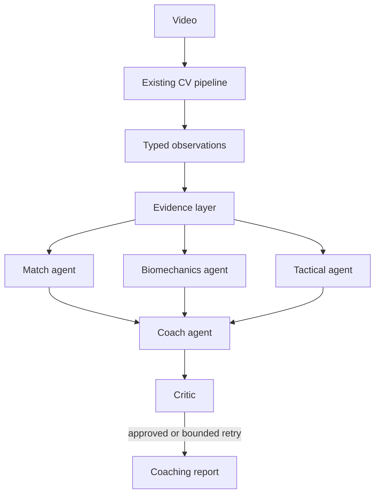

# TennisTracker: Multimodal Multi-Agent Tennis Coach

TennisTracker is an evidence-grounded coaching prototype combining local computer vision, typed evidence, specialized analysis agents, bounded orchestration, and longitudinal coaching foundations. It is not an LLM chatbot: recommendations must cite validated evidence, preserve uncertainty, and state when the current vision pipeline cannot support a conclusion.

## Current capabilities

- Existing OpenCV frame loading and YOLOv8 pose annotation remain available.
- Normalized `StrokeObservation` and auditable `EvidenceItem` contracts preserve confidence, sample size, provenance, and frame ranges.
- Deterministic evidence aggregation calculates stroke composition and contact-point ratios without an LLM.
- Match, biomechanics, and tactical agents have distinct responsibilities and structured outputs.
- Coach synthesis and a critic run through a bounded orchestration loop.
- A mock LLM provider supports deterministic local tests without paid API calls.
- Streamlit exposes upload, analysis status, limitations, coach output, and an execution trace.
- Dense pose sampling can produce a movement-pattern report with linked frame transitions and a practical shadow-swing drill.
- The report includes the source video, a movement chart, representative frames, and an evidence-linked supporting clip.
- Pose inference is configurable through environment variables and uses temporal tracking when available; keypoint confidence is reported separately from person confidence.

## Architecture



See [docs/architecture.md](docs/architecture.md), [docs/agent-design.md](docs/agent-design.md), and [docs/failure-modes.md](docs/failure-modes.md).

## Local setup

```powershell
python -m venv .venv
.\.venv\Scripts\Activate.ps1
pip install -r requirements.txt
streamlit run main.py
```

Tracking uses ByteTrack through Ultralytics and requires `lap`; it is included in `requirements.txt`.

The current entry point reports pose-derived movement evidence with visual support. Stroke type, ball trajectory, court position, and in/out claims remain unavailable until those extractors are implemented.

## Accuracy direction

The current YOLOv8 pose model is a generic baseline, not a tennis-specific accuracy guarantee. The recommended upgrade path is RTMPose through [MMPose](https://github.com/open-mmlab/mmpose) and its [RTMPose project](https://github.com/open-mmlab/mmpose/tree/main/projects/rtmpose), deployed with ONNXRuntime/MMDeploy where latency matters. For ball, court, and bounce signals, [ArtLabss/tennis-tracking](https://github.com/ArtLabss/tennis-tracking) is a useful reference because it separates player detection, court geometry, TrackNet-style ball tracking, and bounce classification. [ViTPose](https://github.com/ViTAE-Transformer/ViTPose) is an accuracy-oriented pose candidate, but its heavier dependencies make it a later benchmark candidate.

Do not switch models based on reputation alone. Compare them on a held-out tennis set using pose detection rate, keypoint confidence, temporal identity switches, event precision/recall, latency, and failure rate. The UI should withhold technical coaching when the capture or model quality gate fails.

## Testing

```powershell
python -m pytest tests
```

Tests use deterministic evidence and mock-provider paths. No API keys are required. Provider configuration belongs in environment variables; secrets are never stored in this repository.

## Evaluation and roadmap

The evaluation design and single-agent baseline are documented in [docs/evaluation.md](docs/evaluation.md). Benchmark results are intentionally not claimed until benchmark fixtures and runners exist. Planned work includes structured session persistence, historical comparison, ball/court/stroke extraction, provider adapters, observability, and evidence-linked video frame inspection.

## Limitations

The repository currently has one real tennis recording, duplicated at `data/raw/` and `testing/`. The visual report is therefore a useful prototype, not a cross-video benchmark. Serve biomechanics, tactical direction, error correlation, and performance improvement remain unavailable until their measurements and independent video fixtures are implemented and validated.