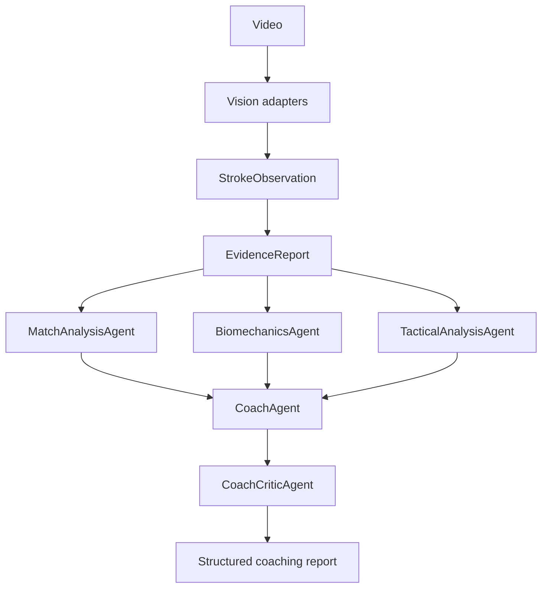

# Architecture

The system separates uncertain video intelligence from reasoning. Vision adapters emit typed observations. The evidence builder validates those observations, normalizes values, aggregates metrics, and attaches provenance and frame references. Agents receive `EvidenceReport`, never arbitrary raw CV dictionaries.

The orchestration is deterministic: three specialists run, the coach synthesizes their structured reports, and the critic validates grounding. Retries are bounded by `max_retries`; ordinary calculations and routing stay in Python. The LLM provider protocol is isolated under `llm/`, with a mock implementation for local development.

Persistence and longitudinal comparison are intentionally pending until the evidence contract is connected to real session extraction.